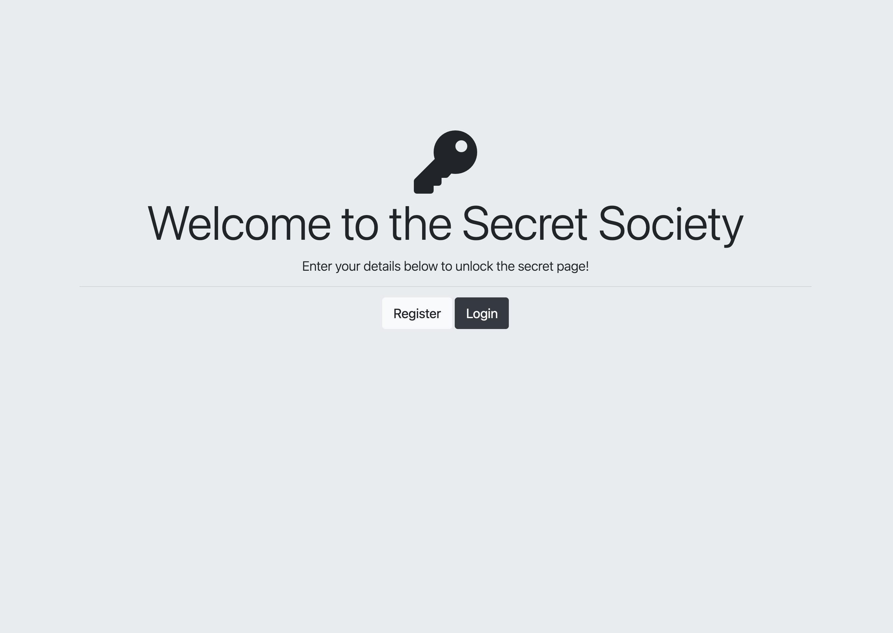

# OAuth-Google-Authentication

[](https://github.com/Cossra/OAuth-Google-Authentication/blob/main/package.json#L3)
[](https://www.npmjs.com/package/oauth-google-authentication)
[](https://github.com/Cossra/OAuth-Google-Authentication/blob/main/LICENSE)
[](https://developers.google.com/identity)
[](https://your-demo-url.com)

---

## Overview

`OAuth-Google-Authentication` is a professional-grade Node.js and Express application built to industry-standard security practices, featuring robust authentication flows and anonymous secret sharing. In this latest iteration, users can:

- **Sign in with Google (OAuth 2.0)** via Passport.js for secure, industry-standard user authentication
- **Register & Login** locally with bcrypt-hashed passwords
- **Submit Secrets**: Authenticated users can anonymously post and view secrets in a shared feed

## Features

- 🔐 **OAuth Google Authentication** via Passport.js for seamless OAuth 2.0 sign-in
- ✍️ **Secret Submission**: Authenticated users can add their own secrets anonymously
- 🗝️ **User Sessions** managed securely with `express-session`
- 🗄️ **PostgreSQL Integration** for persistent user and secret storage
- 🖥️ **EJS Templating** for dynamic, server-rendered views
- 🌐 **Responsive UI** with Bootstrap and Font Awesome

## Screenshots

**Home Page**



**Login Page**


**Google OAuth Flow**


**Secrets Submission**


## Getting Started

### Prerequisites

- Node.js (v14+)
- npm or yarn
- PostgreSQL database

### Installation

1. **Clone the repository**

   ```bash
   git clone https://github.com/Cossra/OAuth-Google-Authentication.git
   cd OAuth-Google-Authentication
   ```

2. **Install dependencies**

   ```bash
   npm install
   # or
   yarn install
   ```

3. **Configure environment variables**

   Copy `.env.example` to `.env` and populate:
   ```ini
   GOOGLE_CLIENT_ID=your-google-client-id
   GOOGLE_CLIENT_SECRET=your-google-client-secret
   SESSION_SECRET=your-session-secret
   PG_USER=your-db-username
   PG_HOST=localhost
   PG_DATABASE=your-db-name
   PG_PASSWORD=your-db-password
   PG_PORT=5432
   ```

4. **Create the database schema** (if not using migrations):

   ```sql
   CREATE TABLE users (
     id SERIAL PRIMARY KEY,
     email VARCHAR(255) UNIQUE NOT NULL,
     password VARCHAR(255) NOT NULL
   );

   CREATE TABLE secrets (
     id SERIAL PRIMARY KEY,
     user_id INTEGER REFERENCES users(id),
     content TEXT NOT NULL,
     created_at TIMESTAMP DEFAULT CURRENT_TIMESTAMP
   );
   ```

5. **Start the application**

   ```bash
   npm start
   # or
   npm run dev
   ```

6. **Open your browser**

   Navigate to `http://localhost:3000` to see the app in action.

## Usage

- **Register/Login**: Use local form or click “Sign in with Google” to authenticate.
- **Submit Secret**: Once logged in, navigate to `/submit` to post an anonymous secret.
- **View Secrets**: Visit `/secrets` to browse all submitted secrets.

## Application Flow

1. **User Authentication**: Local or Google OAuth login establishes a session.
2. **Secret Submission**: Authenticated users send POST requests to `/submit`.
3. **Secret Display**: Server retrieves all secrets from PostgreSQL and renders them on `/secrets` page.

## Folder Structure

```
OAuth-Google-Authentication/
├── public/             # Static assets
│   ├── css/
│   └── js/
├── screenshots/        # Demo images for README
│   ├── secrets-home.ejs.png
│   ├── login-secrets.png
│   ├── Google-Oauth.png
│   └── submit-secret.png
├── views/              # EJS templates
│   ├── partials/       # Header, footer, etc.
│   ├── home.ejs
│   ├── login.ejs
│   ├── register.ejs
│   ├── secrets.ejs
│   └── submit.ejs
├── index.js            # Main server file
├── package.json        # Project metadata and scripts
├── .env                # Environment variables
└── README.md           # Project documentation
```

## Contributing

Contributions are welcome! Please open an issue or submit a pull request.

## License

This project is licensed under the MIT License - see the [LICENSE](https://github.com/Cossra/OAuth-Google-Authentication/blob/main/LICENSE) file for details.

---

*Crafted for hiring managers and recruiters seeking a modern, secure Node.js application showcasing OAuth flows and anonymous user interactions.*
